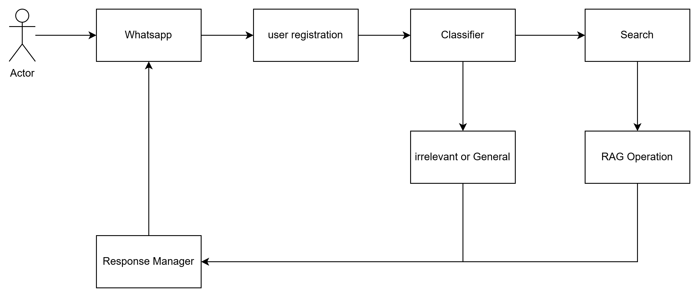

# iDAC Bot

## Architecture of Bot

This diagram represents the architecture of the system:



## Getting Started

### Prerequisites

- Ensure that you are using Python version `3.10.13` for development to avoid any compatibility issues. I recommend using a Python environment manager like `conda` or `poetry` or `venv` is also fine.

Please install the following tools:

- [Docker](https://docs.docker.com/engine/install/)
- [Just](https://github.com/casey/just)
- [Visual Studio Code](https://code.visualstudio.com/) (**Optional, but recommended IDE**)

### Installation

1. **Set up your virtual environment:** Assuming your virtual environment is set up and activated, proceed with the following installations.

   ```sh
   pip install -r dev-requirements.txt
   pre-commit install
    ```

2. **Using pre-commit**: This tool is configured to run checks on your code at each commit. It performs linting with ruff and automatically formats your code. If pre-commit finds any issues, it will cancel the commit, and attempt to fix basic issues automatically. If it unable to do so, you must fix the issues yourself. In either case, files will have been modified so you will have to re-add them before committing. If you encounter any issues with this setup, please contact Shariq.

3. Copy the `example.env` file to `.env` and fill in the required environment variables. If your work requires more environment variables, please add them to the `example.env` file.


### How to resolve ruff fixes

1) When encountering errors in the terminal, use the following command to resolve most of the issues automatically:
   ```bash
   ruff --fix
   ```

2) Other errors generated by Ruff, such as "Docstring missing," are self-explanatory. Make sure to resolve them manually as required.

3) After running the git commit, some of the fixes may be automatically handled by pre-commit and Ruff. Make sure to run:

```bash
    git add .
    git commit -m "your message"
```

### Misc Notes

- If you want to ignore "Line too long" errors for a specific file, because you either don't like how `ruff` formats it (or isn't able to), you can add a comment at the top of the file: `# ruff: noqa: E501` which will ignore that specific error for that file. This is not recommended, but we don't want to waste time fixing line lengths but be conscious that your code may be harder to read.
